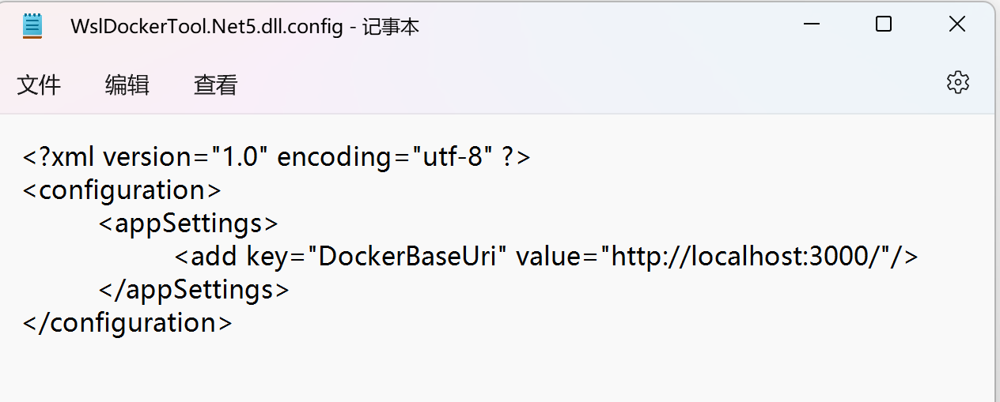
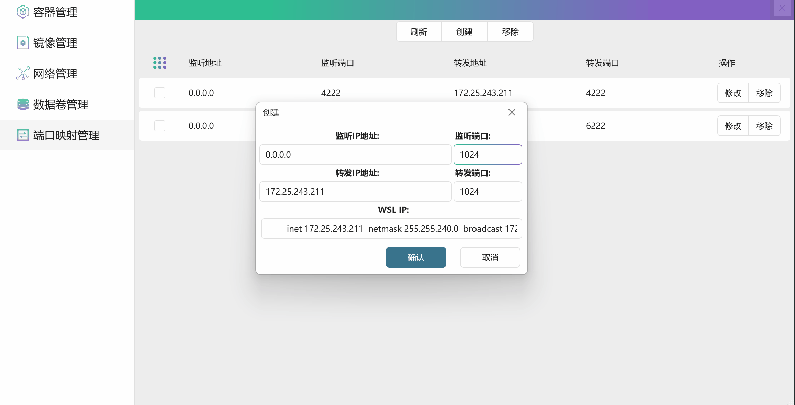
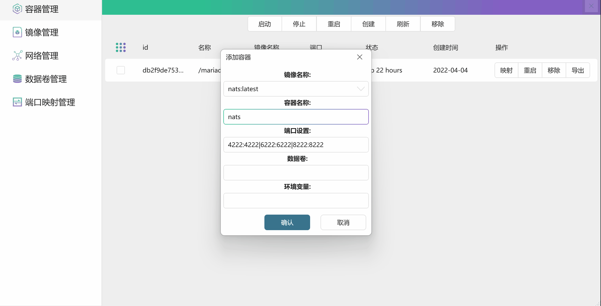
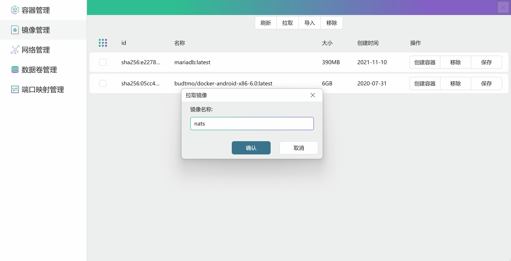

# WslDockerTool

欢迎使用WslDockerTool

WslDockerTool 是一个简单的 Docker UI 操作面板,使用它可以很方便操作Win子系统中 docker (wsl docker),除正常容器管理以外，还可以将子系统端口映射到局域网。


# 目前支持功能
| 镜像 | 拉取、创建容器、保存、导入、批量删除|
| 容器 | 局域网端口映射、批量启动、批量停止、批量运行、批量删除、导出 |
| 端口映射 | 创建、移除、修改 |
| 网络 | 开发中...|
| 数据卷 | 开发中...|


# 使用技术和框架
+ 两个版本 .Net5和.Net 4.61
+ HandyControl 3.3.0
+ AutoMapper 10.1.1
+ Prism.Wpf 8.1.97
+ Docker.DotNet 3.125.5

# 使用安装

###  启用Docker远程访问
 
```sh
sudo nano /etc/docker/daemon.json
```
```Json
{"hosts": ["unix:///var/run/docker.sock", "0.0.0.0:3000"]}
```
###  打开..\WslDockerTool\WslDockerTool.Net5.dll.config 文件 修改地址
 

### 运行程序 WslDockerTool.Net5.exe

# 功能演示

+ 端口映射
  

+ 容器
  

+ 镜像
  


